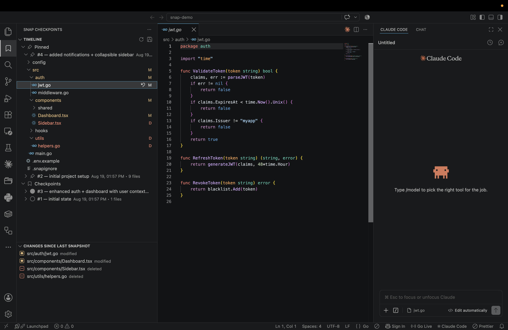
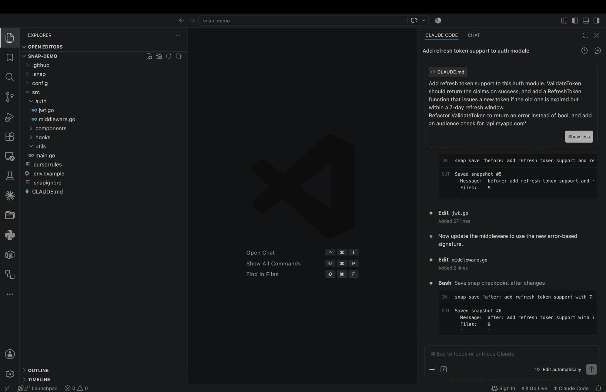
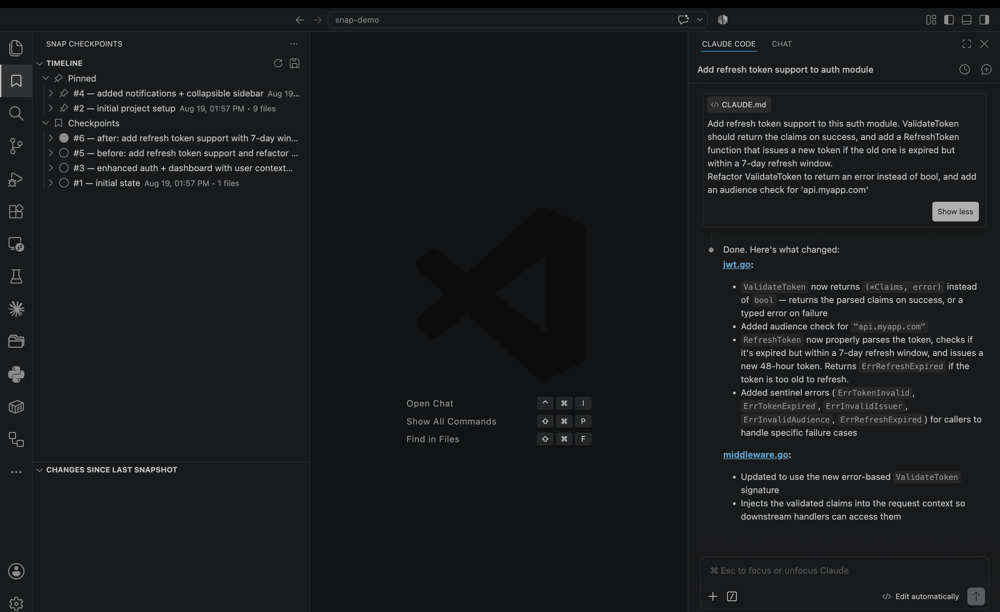
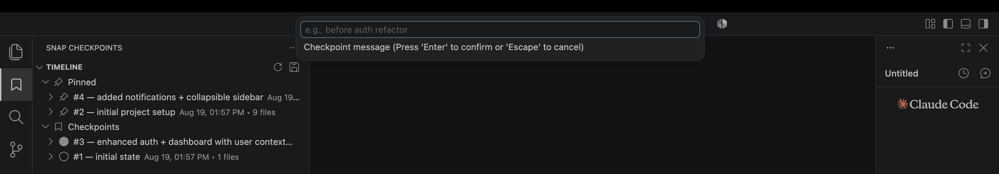
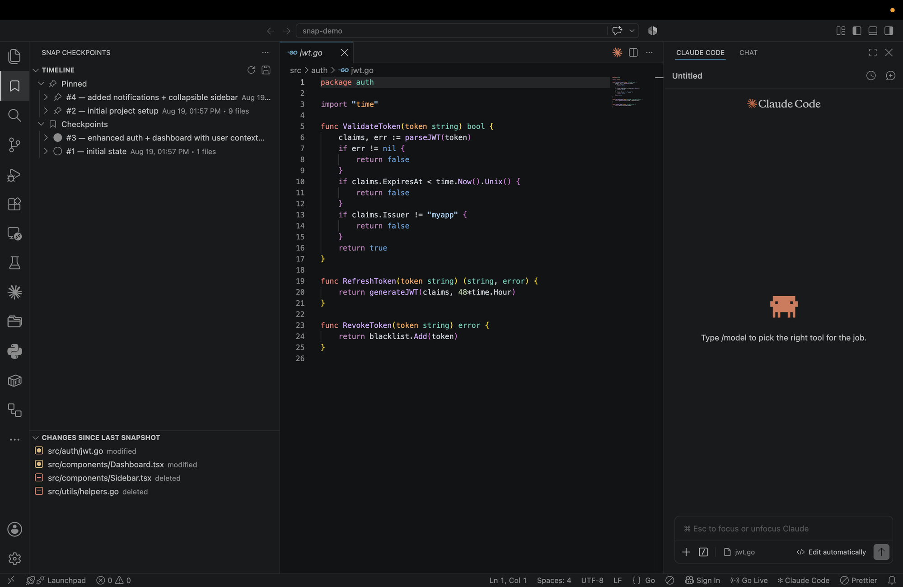
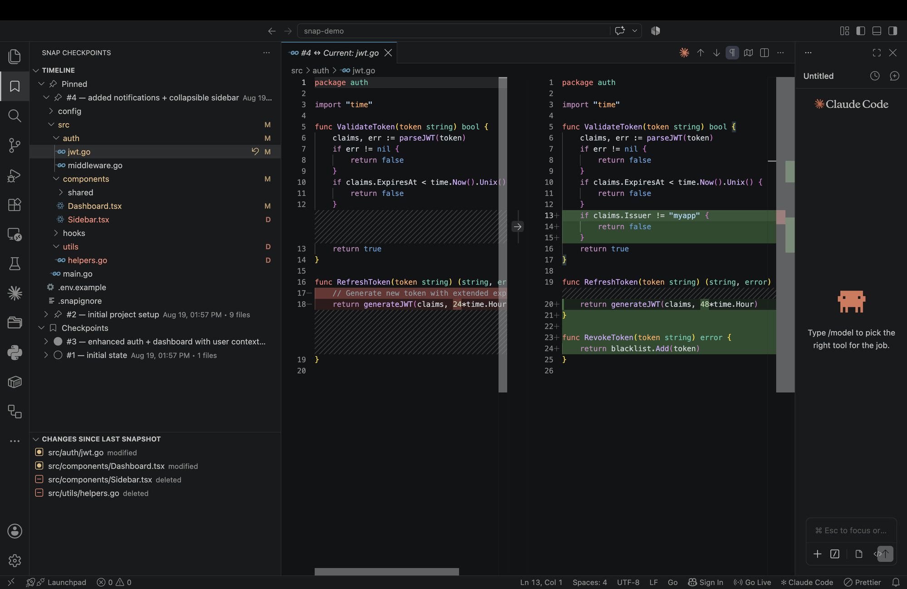
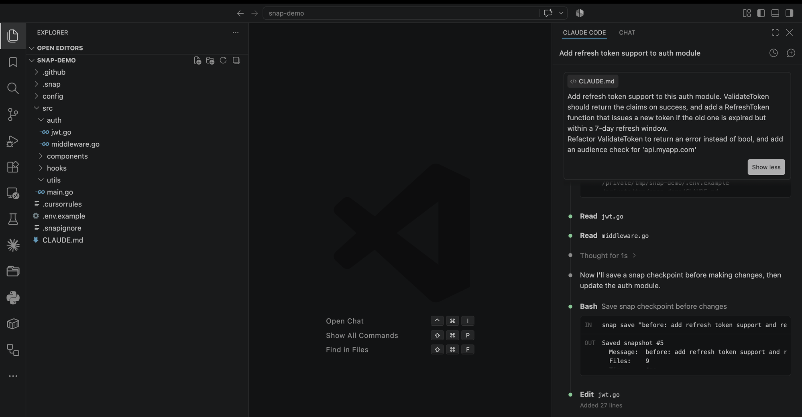

# Snap — Local Development Checkpoints

A fast, local checkpoint tool for developers. Save your project state instantly, diff between any two points, and restore safely — without needing Git commits.

Built for the AI-assisted development workflow where you make experimental changes, hand control to agents, and need a safety net that's faster than `git commit`.



```
┌─────────────────────────────────────────────────┐
│              Your Development Flow               │
│                                                  │
│   Working State                                  │
│        │                                         │
│        ▼                                         │
│   snap save "before refactor"   ← 2ms           │
│        │                                         │
│        ▼                                         │
│   Agent makes changes...                         │
│        │                                         │
│        ▼                                         │
│   snap save "after agent"                        │
│        │                                         │
│        ▼                                         │
│   Something broke?                               │
│        │                                         │
│        ▼                                         │
│   snap restore 3                ← instant        │
│   (auto-saves current state)                     │
│        │                                         │
│        ▼                                         │
│   Back to safety. Zero work lost.                │
└─────────────────────────────────────────────────┘
```

---

## Table of Contents

- [Why Snap Over Git?](#why-snap-over-git-for-experiments)
- [How It Saves Time](#how-it-saves-time)
- [Mix and Match Restores](#mix-and-match--restore-different-files-from-different-checkpoints)
- [AI Agent Integration](#ai-agents-automatically-use-it)
- [All Features](#all-features)
- [Export & Import](#export--import-checkpoints)
- [Installation](#installation)
  - [CLI Installation](#step-1--install-the-cli)
  - [VS Code Extension](#step-2--install-the-vs-code-extension)
- [Using the VS Code Extension](#using-the-vs-code-extension)
- [CLI Quick Reference](#cli-quick-reference)
- [CLI Commands (Detailed)](#cli-commands-detailed)
- [Storage Design](#storage-design)
- [.snapignore](#snapignore)
- [Build from Source](#build-from-source)
- [Architecture](#architecture)
- [Roadmap](#roadmap)

---

## Why Snap Over Git for Experiments?

Git is great for publishing code. But between commits, your code is unprotected.

| Situation | With Git | With Snap |
|-----------|----------|-----------|
| Quick experiment | Create branch, commit, switch back, maybe delete branch | `snap save "before experiment"` → try it → `snap restore 3` if it fails |
| AI agent changes 20 files | Hope it works, or manually inspect all changes | Every file auto-saved before agent touches it. Restore any or all. |
| Compare what changed | `git diff` only works for uncommitted changes | Compare any two points in time, even past checkpoints against each other |
| Half the changes are good, half are bad | Cherry-pick specific hunks, resolve conflicts | Restore only the broken files from the good checkpoint, keep the rest |
| Want to try 3 different approaches | 3 branches, switching context, remembering which is which | Save → try approach 1 → save → try approach 2 → save → compare all three, pick what works |
| Undo one file but keep everything else | `git checkout -- file` only works for uncommitted. Otherwise complex. | `snap restore-file 3 src/auth.go` — done. Rest of project untouched. |
| Share a known-good state with teammate | Create branch, push, coordinate pull/clone | `snap export 3` → send file → `snap import file.snap`. Done. |

Snap is not a replacement for Git. Git is for publishing, collaborating, and version history. Snap is for the messy in-between — the 50 experiments you try before you're ready to commit.

---

## How It Saves Time

- **2ms to save.** No staging, no commit messages you'll never read again, no branch management. Just save and keep moving.
- **Instant restore.** Don't spend 10 minutes trying to manually undo what an agent did. One command — you're back.
- **No cleanup needed.** No stale experiment branches to delete later. No "WIP" commits cluttering your log. Snap checkpoints live locally and clean themselves up.
- **Zero mental overhead.** You don't have to plan when to save. Save early, save often. It costs nothing. If you forget, the auto-save and recording systems have your back.
- **Skip the investigation.** Instead of reading through 20 changed files to find what broke, just diff two checkpoints and see exactly what's different. Or restore file by file until you find the one that broke things.

---

## Mix and Match — Restore Different Files from Different Checkpoints

This is something Git makes very hard, but Snap makes trivial.

Say you have 3 checkpoints. In checkpoint #2 the auth system was perfect. In checkpoint #4 the UI was perfect. But right now both are broken.

With Snap:
```bash
snap restore-file 2 src/auth/middleware.go
snap restore-file 2 src/auth/jwt.go
snap restore-file 4 src/components/Dashboard.tsx
snap restore-file 4 src/components/Sidebar.tsx
```

Done. You now have the best version of each file from different points in time. No merge conflicts, no cherry-picking, no branch gymnastics. Just grab what you need from wherever it was best.

In the VS Code extension: expand any checkpoint → right-click any file → "Restore This File". Do this across multiple checkpoints to assemble exactly the state you want.

---

## AI Agents Automatically Use It

This is where Snap really shines. When you initialize Snap in a project:

**1. Instruction files are auto-created** — Snap generates instruction files (`CLAUDE.md`, `.cursorrules`, `.github/copilot-instructions.md`) that teach AI agents to use Snap. The agent learns to:
- Save a checkpoint before making any risky change
- Save after completing a logical unit of work
- Use continuous recording during large refactors
- Pin important stable states
- Watch critical files like configs and migrations

**2. Auto-save hook** — Configure a hook so that every single time an AI agent is about to edit any file, Snap automatically saves that file first. The agent doesn't even have to "remember" — it's enforced at the system level. If the agent breaks anything, you always have the exact "before" version of every file it touched.

**3. The agent checkpoints for you** — Because the agent reads the instruction file, it will proactively run `snap save "before: auth refactor"` before starting work and `snap save "after: auth refactor"` when done. You get a clean timeline of what the agent did and when — without lifting a finger.



**4. Agent activity detection** — When recording is active, Snap auto-detects when an AI agent makes changes (multiple files changing within seconds) and tags those entries in the timeline as `[agent]`. So you can always tell "this is what I changed" vs "this is what the agent changed."

The result: you hand control to an AI agent with full confidence. If it goes wrong, you have complete recovery options — from a full project restore to surgical single-file rollback. Zero trust required.



### Claude Code Hook (Auto-save before edits)

Add to `~/.claude/settings.json` for automatic protection:

```json
{
  "hooks": {
    "PreToolUse": [
      {
        "matcher": "Edit|Write",
        "hooks": [
          {
            "type": "command",
            "command": "if [ -d .snap ]; then FILE=$(echo \"$TOOL_INPUT\" | python3 -c \"import sys,json; print(json.load(sys.stdin).get('file_path',''))\" 2>/dev/null); if [ -n \"$FILE\" ] && [ -f \"$FILE\" ]; then snap save-file \"$FILE\" \"before agent edit\" 2>/dev/null; fi; fi",
            "timeout": 5,
            "async": true
          }
        ]
      }
    ]
  }
}
```

This auto-saves every file before any agent edits it — zero manual work, fully automatic safety net.

---

## All Features

### Save Checkpoints
Save your entire project state with a message and an optional description. Takes about 2 milliseconds. Only files that actually changed since your last save get stored — so it's fast and space-efficient no matter how big your project is.

### Restore to Any Point
Jump back to any previous checkpoint instantly. Before restoring, Snap automatically saves your current state — so you can never accidentally lose your work. You can always go back to where you were before the restore.

### Single File Restore
Restore just one file from any checkpoint without touching the rest of your project. Mix and match files from different checkpoints to assemble exactly the state you want.

### Diff & Compare
Compare any two checkpoints side by side. See which files were added, modified, or deleted. Drill into individual files to see exactly which lines changed — with full color highlighting. Compare any checkpoint against your current working directory. Compare a specific file between two checkpoints.

### Status — What Changed?
See at a glance what's different since your last checkpoint. Shows all modified, added, and deleted files in a simple list.

### View File at Any Point
Peek at the content of any file at any checkpoint — without restoring the whole project. Great for checking "what did this file look like 3 checkpoints ago?"

### Single File Save
Don't want to save the whole project? Save just one file, or multiple specific files, as a lightweight checkpoint.

### Multi-File Select
Select multiple files at once (Ctrl+click in VS Code explorer) and save them as a single checkpoint. In the CLI, pass multiple file paths in one command.

### Descriptions on Checkpoints
Add an optional description to any checkpoint for extra context — like "JWT working, refresh token pending". Shows up in the timeline and tooltip for easy reference.

### Pin Important Checkpoints
Pin any checkpoint to mark it as important. Pinned checkpoints appear at the top of your timeline in a dedicated "Pinned" section and are never automatically deleted by garbage collection. Unpin anytime to move them back.

### Continuous Background Recording
Start recording and Snap watches every file change in real-time — automatically, in the background. Every save you make to any file is captured with an exact timestamp. This lets you rewind to any second, not just your explicit checkpoints.

### Rewind to Any Moment
When recording is active, jump back to any point in time. Supports natural time formats: "5 minutes ago", "2:30 PM", "14:30:05", "Aug 16 14:30", or full date-times. Just copy a timestamp from the timeline and paste it.

### Timeline Viewer
See a chronological list of every recorded change — which file was modified or created, when, and whether it was you or an AI agent who made the change.

### Watch Critical Files
Mark important files (config files, database migrations, environment files) for automatic checkpointing. Any time a watched file changes, Snap saves it automatically — no manual action needed. Perfect for files that are dangerous to lose or hard to recover.

### Garbage Collection
Over time, checkpoints accumulate. Snap's cleanup command analyzes all your checkpoints and safely removes duplicates, outdated auto-saves, and unreferenced data. Run it manually anytime, or let the automatic hourly cleanup handle it in the background. Pinned and recent checkpoints are never touched.

### Delete Checkpoints
Remove any checkpoint you no longer need. Simple, immediate, with a confirmation prompt.

### .snapignore — Exclude Files
Create a `.snapignore` file to tell Snap which files and folders to skip — like `node_modules`, build folders, `.env` files, or anything else you don't want in your checkpoints. Comes with sensible defaults out of the box. Changes take effect immediately without restarting.

### Separate from Git
Snap doesn't touch your Git history. It's a completely independent system. Your commit history stays clean while you checkpoint as often as you want. No stale branches, no WIP commits, no clutter.

### Auto-Adds to .gitignore
The `.snap` folder is automatically added to your `.gitignore` so checkpoints never get committed to your repository.

### Repair Mode
If your `.snap` folder gets corrupted or partially deleted, running `snap init` again fixes it — detects what's broken and repairs the structure without losing existing checkpoints.

### Export & Import Checkpoints
Export any checkpoint as a portable `.snap` file. Share with teammates, back up critical states, or move checkpoints between machines. Optionally encrypt with AES-256-GCM password protection. Import re-creates the checkpoint in your timeline with all file data intact — deduplicates automatically against existing blobs.

---

## Installation

### Step 1 — Install the CLI

**macOS (Recommended — Homebrew):**

```bash
brew tap NiHaLOO7/snap
brew install NiHaLOO7/snap/devsnap

# Verify
snap version
```

No security warnings, no quarantine issues. Works on both Apple Silicon and Intel.

**macOS (Manual — from .pkg installer):**

Download from [Releases](https://github.com/NiHaLOO7/snap/releases):
- Apple Silicon (M1/M2/M3/M4) → `Snap-1.0.0-mac-arm64.pkg`
- Intel Mac → `Snap-1.0.0-mac-intel.pkg`

Double-click the `.pkg` file and follow the installer.

> If macOS blocks it: System Settings → Privacy & Security → "Open Anyway"

**macOS (Manual — binary):**

```bash
curl -L https://github.com/NiHaLOO7/snap/releases/download/v1.0.0/snap-darwin-arm64 -o snap
chmod +x snap
xattr -d com.apple.quarantine snap
sudo mv snap /usr/local/bin/snap
```

**Linux:**

```bash
curl -L https://github.com/NiHaLOO7/snap/releases/download/v1.0.0/snap-linux-amd64 -o snap
chmod +x snap
sudo mv snap /usr/local/bin/snap
```

**Windows:**

1. Download `snap-windows-amd64.exe` from the release page
2. Rename to `snap.exe`
3. Move to a folder in your PATH (e.g., `C:\Users\YourName\bin\`)
4. Add that folder to your system PATH if not already there

### Step 2 — Install the VS Code Extension

> **Prerequisite:** Install the `snap` CLI first (see above). The extension calls the CLI under the hood.

**Download the extension:**

Download `snap-checkpoints-1.1.0.vsix` from the [Releases](https://github.com/NiHaLOO7/snap/releases) page.

**Install in VS Code:**

Option A — Terminal:
```bash
code --install-extension snap-checkpoints-1.1.0.vsix
```

Option B — VS Code UI:
1. Open VS Code
2. Press `Cmd+Shift+X` (Mac) or `Ctrl+Shift+X` (Windows/Linux) to open Extensions
3. Click the `...` menu at the top-right of the Extensions panel
4. Select **"Install from VSIX..."**
5. Browse to the downloaded `.vsix` file and select it
6. Click **Install**
7. Reload VS Code when prompted

**Verify:**

After reload, you should see a **bookmark icon** in the left activity bar. That's the Snap panel.

### Step 3 — Initialize your project

Open any project folder in VS Code, then either:
- Run `snap init` in the terminal, OR
- Open Command Palette (`Cmd+Shift+P`) → type "Snap: Initialize"

The Snap panel will now show your checkpoints. Done — you're ready to use Snap.

---

## Using the VS Code Extension

Once installed, a bookmark icon appears in your left activity bar. Click it to open the Snap panel with two sections:

### Timeline Panel (top)

Shows all your checkpoints organized into three categories:
- **Pinned** — your most important checkpoints, always at the top, never auto-deleted
- **Checkpoints** — your manually saved snapshots
- **Auto-saves** — automatic saves created by the system (before restores, before agent edits, etc.)

Each checkpoint shows: ID number, message, date & time, and file count.

### Activity Bar Badge

The Snap icon in the activity bar shows a **badge number** — the count of files that have changed since your last full project checkpoint. Hover over it to see exactly which snapshot it's comparing against (e.g., `"5 files changed since #4 "added notifications"`). The badge updates automatically as you edit files, save checkpoints, restore, or delete snapshots.

### Changes Panel (bottom)

Shows files that changed since your last checkpoint — auto-refreshes in real-time as you edit. Shows modified (~), added (+), and deleted (-) files.

### Step-by-step workflow

**1. Save a checkpoint:** Click the save icon at the top of Timeline → type a message like "before refactoring auth" → optionally add a description → your entire project state is saved.



**2. Make changes** — code yourself or let an AI agent work...

**3. Check what's different:** Look at the Changes panel to see what's been modified since your last save.

**4. Browse checkpoint files:** Expand any checkpoint to see a clean folder tree of all files in that snapshot. Folders with only one subfolder are compacted for cleaner display (e.g., "src/auth/middleware" instead of nested individual folders).

**5. Live file status badges:**
- Yellow **M** = this file has been modified since that checkpoint
- Red **D** = this file has been deleted from your current directory
- Folders also show colored status — yellow if they contain modified files, red if all files inside are deleted
- Status updates automatically as you edit files — no manual refresh needed



**6. Diff a file:** Click any file inside a checkpoint → side-by-side diff opens (snapshot on left, current on right). Full syntax highlighting and word-level change detection — same quality as VS Code's built-in Git diff.



**7. View file content:** Right-click a file inside a checkpoint → "Show File" to view that file's content at that point in time (read-only).

**8. Restore entire checkpoint:** Click the restore icon on any checkpoint. It asks for confirmation, auto-saves your current state, then restores. You can always undo by restoring the auto-save.

**9. Restore single file:** Click the restore icon on a specific file inside any checkpoint. Only that file gets restored — everything else stays as-is.

**10. Save specific files:** Right-click one or multiple files in the VS Code Explorer → "Snap: Save This File". Saves just those files as a checkpoint. Also works from the editor right-click menu for the currently open file.



**11. Pin/Unpin:** Click the pin icon on any checkpoint to pin it. It moves to the "Pinned" section at the top and will never be auto-deleted. Click the unpin icon to move it back to its original category.

**12. Delete:** Click the trash icon on any checkpoint to remove it permanently (with confirmation).

**13. Refresh:** Click the refresh icon at the top to manually refresh the timeline. The extension also auto-refreshes when files change on disk.

**14. Export a checkpoint:** Right-click any checkpoint in the Timeline → "Export". Optionally set a password for AES-256 encryption → choose save location → get a portable `.snap` file containing the full checkpoint (metadata + all blobs + integrity checksum).

**15. Import a checkpoint:** `Cmd+Shift+P` → "Snap: Import Checkpoint" → browse to a `.snap` file → enter password if encrypted → done. New checkpoint appears in timeline as `[imported]`, ready to diff/restore like any other checkpoint.

---

## CLI Quick Reference

| Command | What it does |
|---------|-------------|
| `snap init` | Set up Snap in your project |
| `snap save "message"` | Save a full project checkpoint |
| `snap save "msg" -d "description"` | Save with extra context |
| `snap save-file path/to/file "message"` | Save specific file(s) |
| `snap list` | Show all checkpoints |
| `snap status` | What changed since last save |
| `snap diff 3` | Compare checkpoint #3 vs current |
| `snap diff 1 5` | Compare two checkpoints |
| `snap diff 1 5 -f` | Full line-by-line diff |
| `snap diff 1 2 src/main.go` | Diff a specific file between two checkpoints |
| `snap show 3` | List files in checkpoint #3 |
| `snap show 3 src/main.go` | View file content at #3 |
| `snap restore 3` | Restore to checkpoint #3 (auto-saves current state first) |
| `snap restore-file 3 src/main.go` | Restore just one file from any checkpoint |
| `snap delete 4` | Delete a checkpoint |
| `snap pin 3` | Pin a checkpoint (never auto-deleted) |
| `snap unpin 3` | Unpin a checkpoint |
| `snap record start` | Start background recording |
| `snap record stop` | Stop recording |
| `snap record status` | Check if recording is active |
| `snap timeline` | View all recorded changes with timestamps |
| `snap rewind "5 minutes ago"` | Jump back in time |
| `snap rewind "2:30 PM"` | Rewind to specific time |
| `snap rewind "Aug 16 14:30"` | Rewind to specific date and time |
| `snap watch add config.yml` | Auto-checkpoint this file on every change |
| `snap watch list` | Show watched files |
| `snap watch remove config.yml` | Stop watching a file |
| `snap clean` | Remove old/duplicate snapshots |
| `snap clean --dry-run` | Preview cleanup without doing it |
| `snap clean --auto` | Cleanup without confirmation prompt |
| `snap export 3` | Export checkpoint #3 as a portable .snap file |
| `snap export 3 -p "pass"` | Export with AES-256 password protection |
| `snap export 3 -o file.snap` | Export with custom output filename |
| `snap import file.snap` | Import a .snap file as new checkpoint |
| `snap import file.snap -p "pass"` | Import a password-protected file |
| `snap update-rules` | Update AI instruction files (CLAUDE.md, .cursorrules, copilot-instructions) to latest |
| `snap setup-hooks` | Install Claude Code auto-save hook in ~/.claude/settings.json |
| `snap init --setup-hooks` | Initialize + install Claude Code hook in one step |

---

## CLI Commands (Detailed)

### `snap init [--setup-hooks]`

Initialize snap in the current directory. Creates a `.snap/` folder, saves initial checkpoint, and generates AI agent instruction files (CLAUDE.md, .cursorrules, .github/copilot-instructions.md).

Running again on an already-initialized project repairs the structure and updates instruction files to the latest version.

```
$ snap init
Initialized snap in /Users/you/project/.snap/
  Saved initial checkpoint #1 (42 files)
  Created CLAUDE.md with snap rules
  Created .cursorrules with snap rules
  Created .github/copilot-instructions.md with snap rules

  To install Claude Code auto-save hook:
    snap setup-hooks

$ snap init --setup-hooks
# Same as above + installs Claude Code PreToolUse hook
```

---

### `snap setup-hooks`

Install a Claude Code PreToolUse hook that automatically saves every file before an agent edits it. Modifies `~/.claude/settings.json`. Safe to run multiple times — skips if already configured. Works on macOS, Linux, and Windows.

```
$ snap setup-hooks
  Claude Code hook installed — auto-saves files before every agent edit ✓

$ snap setup-hooks
  Claude Code hook already configured ✓
```

---

### `snap update-rules`

Update AI agent instruction files (CLAUDE.md, .cursorrules, .github/copilot-instructions.md) to the latest rules without re-initializing. Use after updating the snap CLI to get the newest agent instructions.

```
$ snap update-rules
  Updated CLAUDE.md with latest snap rules
  Updated .cursorrules with latest snap rules
  Updated .github/copilot-instructions.md with latest snap rules
Agent instruction files updated to latest rules.
```

---

### `snap save [message] [-d "description"]`

Take a snapshot of the entire project state. Description is optional.

```
$ snap save "before oauth implementation"
Saved snapshot #4
  Message:  before oauth implementation
  Files:    47
  Time:     12ms

$ snap save "auth done" -d "JWT tokens working, refresh token still pending"
Saved snapshot #5
  Message:  auth done
  Desc:     JWT tokens working, refresh token still pending
  Files:    48
  Time:     8ms
```

---

### `snap list` / `snap ls`

Show all checkpoints organized by category.

```
$ snap list

📌 Checkpoints (3)

  ● #1     Aug 11 10:02  initial state  (42 files)
  │
  ● #3     Aug 11 11:15  after auth refactor  (47 files)
  │
  ◉ #5     Aug 11 11:45  working oauth  (48 files)
  │         JWT tokens working, refresh token still pending

🔄 Auto-saves (2)

  ○ #4     Aug 11 11:20  auto-save before restore to #2 "before auth"  (47 files)
  │
  ◎ #6     Aug 11 12:01  auto-save before restore to #1 "initial state"  (48 files)

  Total: 3 checkpoints, 2 auto-saves
```

---

### `snap show <id> [file]`

View what's inside a checkpoint — list files or view specific file content.

```
# List all files in a snapshot
$ snap show 3
Snapshot #3 "after auth refactor" (Aug 11 11:15)
Files (47):

  README.md
  src/auth/jwt.go
  src/auth/middleware.go
  src/main.go
  ...

# View a specific file's content at that snapshot
$ snap show 3 src/auth/jwt.go
── src/auth/jwt.go (snapshot #3) ──

package auth

import (
    "crypto/sha256"
    ...
)
```

---

### `snap restore <id>`

Jump back to any previous state. **Always auto-saves current state first** — you can never lose work.

```
$ snap restore 2
Auto-saving current state before restore...
  Saved as #6

Restoring to #2 "before auth refactor"...
Restored successfully. (42 files)

Your previous state is saved as #6 if you need it back.
```

---

### `snap diff`

Compare any two states. Multiple modes available.

```
# Snapshot vs current working directory
$ snap diff 3
Snapshot #3 "after auth"  →  Current working directory

  + src/new_file.go  (added)
  ~ src/auth.go  (modified)
  - src/old.go  (deleted)

  1 modified, 1 added, 1 deleted

# Between two snapshots
$ snap diff 1 5

# Full line-level diff (colored output)
$ snap diff 1 5 -f
Snapshot #1 "initial"  →  Snapshot #5 "oauth working"

  ~ src/main.go  (modified)
    @@ -3,6 +3,8 @@
      import "fmt"

      func main() {
    -     fmt.Println("Hello")
    +     fmt.Println("Hello World")
    +     startAuth()
      }

# Diff a specific file only
$ snap diff 1 2 src/main.go
── src/main.go ──
Snapshot #1 "initial"  →  Snapshot #2 "after changes"

@@ -3,6 +3,6 @@
  import "fmt"

  func main() {
-     fmt.Println("Hello")
+     fmt.Println("Hello World")
  }
```

---

### `snap status`

Show what changed since the last snapshot.

```
$ snap status
Last snapshot: #5 "working oauth" (Aug 11 11:45)

  Changes since last snapshot:

    ~ src/auth.go
    + src/middleware.go
    - src/old_handler.go

  1 modified, 1 added, 1 deleted
```

---

### `snap delete <id>` / `snap rm <id>`

Delete a checkpoint you no longer need.

```
$ snap delete 4
Deleted snapshot #4 "auto-save before restore to #2"
```

---

### `snap record start/stop/status`

Continuous background recording — capture every file change automatically.

```bash
# Start recording (runs as background daemon)
snap record start

# Check status
snap record status
⏺  Recording active (PID 12345)
   47 changes recorded over 2h15m
   Storage: 89.3 KB

# View recent changes
snap timeline
Timeline — last 20 changes (total: 47)

  Aug 16 14:30:12 ~ src/auth.go modify
  Aug 16 14:30:15 + src/middleware.go create
  Aug 16 14:31:02 ~ src/auth.go modify [agent]
  Aug 16 14:31:02 ~ src/handler.go modify [agent]
  ...

# Rewind to any moment
snap rewind "5 minutes ago"
snap rewind "2:47 PM"
snap rewind "14:30:05"
snap rewind "Aug 16 14:30"

# Stop recording
snap record stop
```

---

### `snap save-file` / `snap restore-file`

Save and restore individual files without affecting the rest of your project:

```bash
# Save just one file
snap save-file src/auth.go "before refactor"

# Save multiple files
snap save-file src/auth.go src/middleware.go -m "before auth changes"

# Restore a single file from any snapshot
snap restore-file 3 src/auth.go
```

---

### `snap pin` / `snap unpin`

Pin important snapshots so they're never auto-deleted by garbage collection:

```bash
snap pin 3        # Pin — never auto-deleted
snap unpin 3      # Unpin
snap list         # Shows ⭐ pinned tag
```

---

### `snap watch`

Mark files for automatic checkpointing on every change:

```bash
# Add a file to watchlist
snap watch add config/database.yml

# List watched files
snap watch list
Watched files:
  config/database.yml
  db/migrations/latest.sql

# Remove from watchlist
snap watch remove config/database.yml
```

When recording is active, any change to a watched file automatically creates a single-file checkpoint.

---

### `snap clean`

Analyze and remove safe-to-delete snapshots:

```bash
$ snap clean

Snap Clean Analysis:

  Total snapshots: 89
  Safe to remove:  62 snapshots
  Keeping:         27 snapshots
  Orphaned objects: 15
  Space to free:   290.4 MB

  Removals:
    #12  [auto] auto-save before restore (3 days ago) — superseded by newer auto-save within 5 min
    #15  [auto] auto-save before edit (5 days ago) — duplicate of #14 (identical state)
    ...

Proceed? [y/n]
```

Flags:
- `snap clean --dry-run` — show what would be removed, no changes
- `snap clean --auto` — remove without confirmation (for scripts/automation)

**Automatic GC:** When recording is active, the daemon runs garbage collection every hour automatically. Removes duplicates, superseded auto-saves, old auto-saves beyond 7-day retention, and orphaned objects. Never touches pinned or user-created recent snapshots.

---

## Storage Design

Snap uses a **content-addressed object store** — the same fundamental approach as Git:

```
.snap/
├── objects/              # Content-addressed blob store
│   ├── a3/
│   │   └── 4f8b2c...    # zlib-compressed file content
│   ├── 7c/
│   │   └── 2e91f0...
│   └── ...
├── snapshots/            # Snapshot metadata (JSON)
│   ├── 0001.json
│   ├── 0002.json
│   └── ...
└── config.json
```

**How deduplication works:**

```
Snapshot #1: { "src/main.go": "abc123", "src/utils.go": "def456" }
Snapshot #2: { "src/main.go": "xyz789", "src/utils.go": "def456" }
                                ↑ new blob              ↑ same hash — NOT stored again
```

If 200 files exist and only 5 changed since last save, only 5 new blobs are stored. The other 195 paths point to existing objects.

**Key properties:**
- **SHA-256 hashing** — content integrity guaranteed
- **Zlib compression** — all blobs compressed on disk
- **Deduplication** — unchanged files cost zero additional storage
- **Independence** — every snapshot is self-contained, can be deleted without breaking others

---

## Export & Import Checkpoints

Share checkpoints as portable `.snap` files — across machines, with teammates, or as backups. Optionally password-protect with AES-256-GCM encryption.

**Use cases:**
- Share a known-good state with a teammate debugging the same issue
- Back up a critical checkpoint before a risky migration
- Move checkpoints between your work laptop and home machine
- Archive a stable state before `snap clean` removes older snapshots

### Export

```bash
# Export checkpoint #3 as a .snap file
snap export 3
# → checkpoint-3-before-oauth.snap

# Export with custom filename
snap export 3 -o stable-auth.snap

# Export with password protection (AES-256-GCM)
snap export 3 -p "mypassword"
```

### Import

```bash
# Import into your timeline
snap import checkpoint-3-before-oauth.snap
# → creates a new checkpoint tagged [imported]

# Import a password-protected file
snap import stable-auth.snap -p "mypassword"
```

**File format:** Self-contained binary (magic header + metadata + all blobs + SHA-256 checksum). Deduplication on import — blobs already in your store are skipped.

### VS Code Extension

Export and import are also available from the extension:
- **Export:** Right-click any checkpoint in the Timeline panel → "Export" → optionally set a password → choose save location
- **Import:** Command Palette (`Cmd+Shift+P`) → "Snap: Import Checkpoint" → select `.snap` file → enter password if encrypted → checkpoint appears in timeline as `[imported]`

---

## .snapignore

Create a `.snapignore` file in your project root to exclude files/directories:

```
# Dependencies
node_modules
vendor
.venv

# Build output
dist
build
*.exe

# IDE
.idea

# Secrets
.env
*.pem
```

**Default ignores** (always excluded even without `.snapignore`):
- `.snap`, `.git`
- `node_modules`, `vendor`, `__pycache__`
- `.DS_Store`
- `*.exe`, `*.dll`, `*.so`, `*.dylib`
- `dist`, `build`, `.env`, `tmp`

---

## Build from Source

Requires Go 1.21+.

```bash
# Clone
git clone https://github.com/NiHaLOO7/snap.git
cd snap

# Build for your platform
go build -o snap ./cmd/snap/
sudo mv snap /usr/local/bin/

# Or build all platforms
make build-all
# Binaries will be in dist/
```

**Build the VS Code extension:**

```bash
cd vscode-extension
npm install
npx tsc -p ./
npx @vscode/vsce package --allow-missing-repository
# Produces snap-checkpoints-x.x.x.vsix
```

---

## Architecture

```
snap/
├── cmd/snap/main.go              # CLI entry point, all commands
├── internal/
│   ├── store/store.go            # Content-addressed object store (SHA-256 + zlib)
│   ├── snapshot/snapshot.go      # Save/restore/list engine
│   ├── diff/diff.go              # Tree comparison + LCS line diff
│   ├── ignore/ignore.go          # .snapignore pattern matching (live reload)
│   ├── delta/delta.go            # Timeline recording storage engine
│   └── recorder/recorder.go     # File watcher daemon (fsnotify)
├── vscode-extension/
│   ├── src/extension.ts          # Extension activation, commands
│   ├── src/snapProvider.ts       # Timeline tree view (categories + files)
│   ├── src/changesProvider.ts    # Changed files panel
│   └── src/snapCli.ts            # CLI wrapper for extension
├── Makefile                      # Cross-platform build targets
└── README.md
```

**Tech Stack:**
- **CLI:** Go
- **Hashing:** SHA-256 (`crypto/sha256`)
- **Compression:** zlib (`compress/zlib`)
- **Diff:** LCS-based algorithm
- **File Watching:** fsnotify
- **Extension:** TypeScript, VS Code API
- **Storage:** File-based, content-addressed

---

## Who It's For

- Developers who experiment with code and want a fast undo
- Anyone working with AI coding assistants (Claude Code, Cursor, Copilot, Windsurf)
- Teams where agents make large changes and you need confidence nothing is lost
- Anyone who finds Git branches/stash too heavy for quick experiments
- Developers who want to freely try things without thinking about version control
- Anyone who's ever lost work because they didn't commit soon enough

---

## Roadmap

- [x] Content-addressed object store
- [x] Snapshot save with deduplication
- [x] Snapshot restore with auto-save safety
- [x] Categorized listing (Checkpoints vs Auto-saves)
- [x] Optional descriptions on checkpoints
- [x] Tree-level diff (file changes)
- [x] Line-level diff with color output
- [x] File-specific diff mode
- [x] File viewer at any checkpoint
- [x] Checkpoint deletion
- [x] Pin/unpin snapshots
- [x] Single file save/restore
- [x] Multi-file save support
- [x] Status (changes since last save)
- [x] `.snapignore` support (live reload)
- [x] VS Code extension with native diff
- [x] VS Code file status decorations (M/D badges)
- [x] VS Code folder tree view with compaction
- [x] VS Code pin/unpin from sidebar
- [x] VS Code activity bar badge (changed files count with snapshot reference)
- [x] Cross-platform binaries (macOS/Windows/Linux)
- [x] Continuous recording (background file watcher)
- [x] Rewind to any timestamp (multiple formats supported)
- [x] Timeline viewer with agent detection
- [x] Auto-create `.snapignore` + auto-add `.snap` to `.gitignore`
- [x] `snap init` = repair mode (fixes broken structure)
- [x] Agent instruction files (CLAUDE.md, .cursorrules, copilot-instructions)
- [x] Claude Code PreToolUse hook (auto-save before agent edits)
- [x] Watch critical files (auto-checkpoint on change)
- [x] Garbage collection (`snap clean` + automatic hourly GC)
- [x] Auto-save before single file restore
- [x] Export/import checkpoints as portable `.snap` files with AES-256 encryption
- [x] `snap update-rules` — refresh AI instruction files without re-init
- [x] `snap setup-hooks` — auto-install Claude Code PreToolUse hook (cross-platform)
- [x] Compare file between two checkpoints (VS Code extension)
- [x] Auto-refresh timeline on panel visibility toggle
- [ ] `snap when` — binary search timeline to find breaking change
- [ ] `snap stash` — named working states for context switching
- [ ] Snapshot export to Git commit

### Future Vision

**Agent-to-Agent Collaboration** — Snap checkpoints as a portable state protocol between AI agents. A coding agent exports its work as a `.snap` file, hands it to a review agent, which imports, inspects, annotates, and passes the verdict back — all without Git commits or shared filesystems. Enables multi-agent workflows (code → review → test → merge) where each agent works independently on the same codebase state.

**Parallel Workspaces** — Isolated code environments where multiple agents (or the same agent) explore different approaches simultaneously. Each workspace is an independent timeline branching from a common checkpoint — agents experiment freely without interfering with each other. The user can compare results across timelines and merge the best outcome back. Think multiverse-style development: every idea gets its own reality to prove itself.

---

## License

MIT
